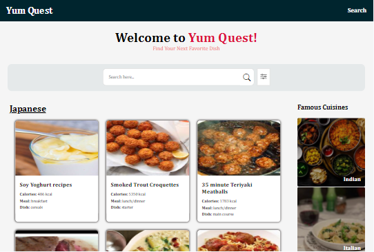

# Yum Quest - Recipe Search App

Yum Quest - The recipe search app features a search input and filter options for Health, Cuisine, and Meal categories. Users can type a search term and select filters using radio buttons. Clicking the search button constructs a URL with the selected parameters, updates a heading to reflect the input and filters, and displays a message if no input or filters are provided. The app then fetches recipe data from the constructed URL.

It also has a cuisines menu which displays recipes based on the cuisines selected.